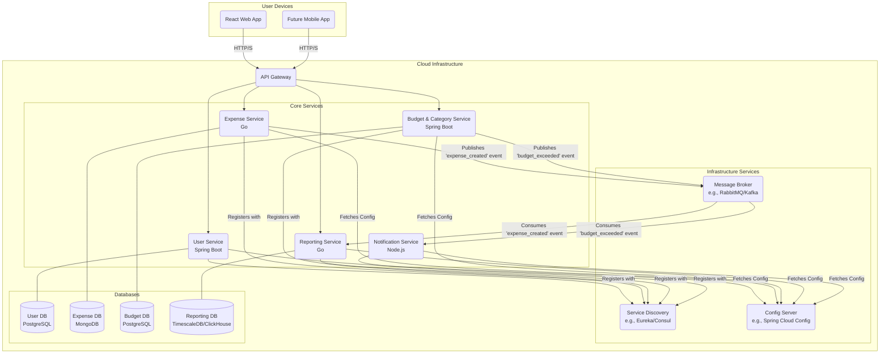

# Financier - A Microservices-Based Expense Management System

Welcome to **Financier**, a modern, cloud-native application designed to help you manage your expenses with ease. This project is built using a microservices architecture, allowing for scalability, resilience, and technological flexibility.

---

## Table of Contents

- [Core Concept](#core-concept)
- [System Architecture](#system-architecture)
  - [Architecture Diagram](#architecture-diagram)
- [Services Breakdown](#services-breakdown)
  - [User Service (Spring Boot)](#1-user-service-spring-boot)
  - [Expense Service (Go)](#2-expense-service-go)
  - [Budget & Category Service (Spring Boot)](#3-budget--category-service-spring-boot)
  - [Reporting Service (Go)](#4-reporting-service-go)
  - [Notification Service (Node.js)](#5-notification-service-nodejs)
  - [Frontend Web App (React)](#6-frontend-web-app-react)
- [Infrastructure & Shared Services](#infrastructure--shared-services)
- [Technology Stack](#technology-stack)
- [Future Planning: Mobile App](#future-planning-mobile-app)
- [Next Steps & Getting Started](#next-steps--getting-started)

---

## Core Concept

The primary goal of Financier is to provide a seamless expense tracking experience. By leveraging a microservices architecture, we break down the application into smaller, independent services. Each service has a specific business responsibility, its own database, and can be developed, deployed, and scaled independently.

**This approach allows us to:**

- **Use the best tool for the job:** Select different technologies (Spring Boot, Go, Node.js) for different services based on their strengths.
- **Improve Scalability:** Scale individual services that are under high load without affecting the rest of the system.
- **Increase Resilience:** An issue in one service is less likely to bring down the entire application.
- **Enable Faster Development:** Teams can work on different services in parallel.

---

## System Architecture

The system is designed around a set of core microservices that communicate with each other through a combination of synchronous REST APIs (via an API Gateway) and asynchronous events (via a Message Broker).

### Architecture Diagram

---

## Services Breakdown

### 1. User Service (Spring Boot)

- **Responsibility:** Handles all aspects of user management, authentication, and authorization.
- **Technology:** Java / Spring Boot with Spring Security.
- **Key Features:**
  - User registration and profile management
  - Secure login using JWT (JSON Web Tokens)
  - Password management (hashing, reset)
  - API endpoint protection
- **Database:** PostgreSQL (Relational data is a good fit for user information)
- **Example Endpoints:**
  - `POST /api/users/register`
  - `POST /api/users/login`
  - `GET /api/users/me`

### 2. Expense Service (Go)

- **Responsibility:** Core logic for creating, reading, updating, and deleting expenses (CRUD).
- **Technology:** Go (Chosen for performance and efficiency in handling high-volume transactions).
- **Key Features:**
  - Add new expenses with details (amount, vendor, date, category)
  - View, edit, and delete existing expenses
  - List expenses with filtering and pagination
  - Publishes an `expense_created` event to the message broker when a new expense is added
- **Database:** MongoDB (Schema flexibility is great for storing varied expense data, like receipts or custom fields)
- **Example Endpoints:**
  - `POST /api/expenses`
  - `GET /api/expenses?category=food`
  - `PUT /api/expenses/{id}`

### 3. Budget & Category Service (Spring Boot)

- **Responsibility:** Manages expense categories and user-defined budgets.
- **Technology:** Java / Spring Boot.
- **Key Features:**
  - CRUD operations for expense categories (e.g., Food, Transport, Utilities)
  - Set monthly or custom budgets for specific categories
  - Tracks spending against budgets and publishes `budget_exceeded` events
- **Database:** PostgreSQL
- **Example Endpoints:**
  - `GET /api/categories`
  - `POST /api/budgets`
  - `GET /api/budgets/status`

### 4. Reporting Service (Go)

- **Responsibility:** Aggregates data and generates insights and reports.
- **Technology:** Go (Excellent for data processing and aggregation)
- **Key Features:**
  - Listens for `expense_created` events to build near real-time analytics
  - Generates monthly spending reports
  - Provides data for frontend charts (e.g., spending by category)
- **Database:** A time-series or analytical database like TimescaleDB or ClickHouse would be ideal for performance
- **Example Endpoints:**
  - `GET /api/reports/monthly?month=9&year=2025`
  - `GET /api/reports/spending-by-category`

### 5. Notification Service (Node.js)

- **Responsibility:** Sends notifications to users via various channels
- **Technology:** Node.js (Excellent for I/O-bound tasks like sending emails or push notifications)
- **Key Features:**
  - Listens for events like `budget_exceeded` from the message broker
  - Sends email notifications
  - (Future) Sends mobile push notifications
- **Database:** None required, it's a stateless service

### 6. Frontend Web App (React)

- **Responsibility:** Provides the user interface for the application
- **Technology:** React
- **Key Features:**
  - A Single Page Application (SPA) for a smooth user experience
  - Communicates with the backend microservices via the API Gateway
  - State management using tools like Redux or Zustand
  - Data visualization using a charting library like Chart.js or D3

---

## Infrastructure & Shared Services

- **API Gateway:** A single entry point for all client requests. Handles routing, rate limiting, and authentication, forwarding requests to the appropriate microservice.
- **Service Discovery:** Allows services to find and communicate with each other without hardcoding hostnames and ports.
- **Config Server:** Centralizes configuration for all services, allowing for dynamic updates without restarting services.
- **Message Broker:** Facilitates asynchronous communication between services, decoupling them and improving resilience.

---

## Technology Stack

- **Frontend:** React
- **Backend:** Spring Boot (Java), Go, Node.js
- **Databases:** PostgreSQL, MongoDB, TimescaleDB (or similar)
- **Infrastructure:** Docker, Kubernetes (for deployment)
- **Communication:** REST, RabbitMQ (or Kafka)

---

## Future Planning: Mobile App

This architecture is perfectly suited for a future mobile app (iOS/Android). The mobile app will act as another client, just like the React web app. It will communicate with the backend through the exact same API Gateway, ensuring a consistent experience and reusing all the existing business logic without any changes to the backend services.

---

## Next Steps & Getting Started

This document outlines the master plan. The development process should be iterative:

1. **Setup Environment:** Set up Docker, Java (JDK), Go, and Node.js on your development machine.
2. **Infrastructure First:** Begin by setting up the infrastructure services (API Gateway, Service Discovery, Config Server) using Docker Compose for local development.
3. **Develop User Service:** This is the foundational service. Build the User Service with registration and JWT-based login.
4. **Develop React Frontend:** Create a basic React app that can register and log in by communicating with the User Service.
5. **Iterate on Services:** Continue by developing the other services one by one, integrating them as you go. A good order would be:

- Budget & Category Service
- Expense Service
- Reporting & Notification Services

6. **Testing:** Write unit and integration tests for each service.
7. **Deployment:** Use Docker and Kubernetes to containerize and deploy the services.
8. **Monitoring & Logging:** Implement monitoring (Prometheus, Grafana) and centralized logging (ELK Stack) for observability.
9. **Documentation:** Maintain comprehensive API documentation using tools like Swagger/OpenAPI.
10. **Iterate & Improve:** Continuously gather feedback, improve features, and optimize performance.

---
